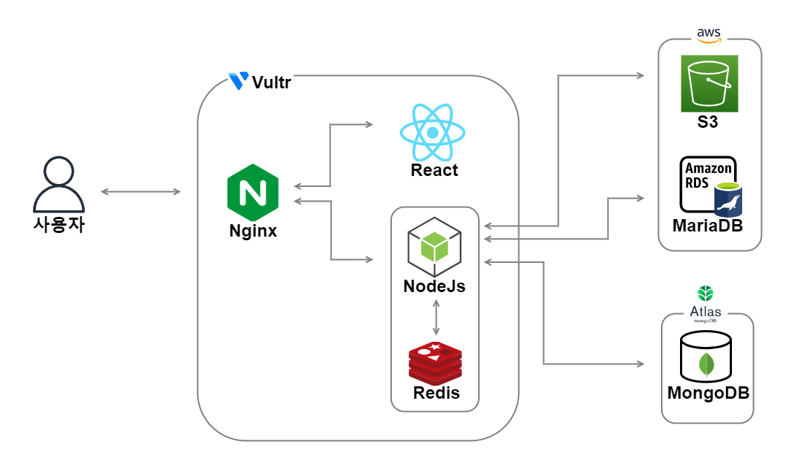

## 🌸 공감과 이야기가 피어나는 블로그

> 사람들이 댓글과 게시글을 통해 생각과 이야기를 나누고, 사용자 프로필 및 게시글을 손쉽게 관리할 수 있도록 설계된 블로그 플랫폼입니다.

## 📚 목차

- [🖥️ 서버 구조](#️서버-구조)
- [🗂️ ERD](#️erd)
- [⚙️ 기술 스택](#️기술-스택)
- [🛠️ 주요 기능 소개](#️주요-기능-소개)
  - [기능 1: 인증 구현](#기능-1-인증-구현)
  - [기능 2: 게시판 및 카테고리 구현](#기능-2-게시판-및-카테고리-구현)
  - [기능 3: 사용자 팔로우 및 프로필 관리](#기능-3-사용자-팔로우-및-프로필-관리)
  - [기능 4: 임시 저장 기능](#기능-4-임시-저장-기능)
- [👥 팀원 소개](#팀원-소개)

---

## 🖥️ 서버 구조

---

## 🗂️ ERD

👉 [ERD CLOUD 보기](https://www.erdcloud.com/d/uBwW7d2NLMPz684CC)  
-1.png>)

---

## ⚙️ 기술 스택

| **분류**     | **스택**                                                                                                                                                                                                                                                                                                                                                                                                                           |
| ------------ | ---------------------------------------------------------------------------------------------------------------------------------------------------------------------------------------------------------------------------------------------------------------------------------------------------------------------------------------------------------------------------------------------------------------------------------- |
| **Frontend** |                                                                                                                                                                                                                                                                                                                                  |
| **Backend**  | ,                                                                                                                                                                                                               |
| **Database** | , , ,  |

---

## 🛠️ 주요 기능 소개

### 기능 1: 인증 구현

- **로컬 회원가입 및 로그인**: 사용자가 아이디와 비밀번호로 로그인할 수 있는 기능
- **구글 로그인**: 구글 OAuth를 이용하여 간편하게 로그인할 수 있는 기능

  **사용된 라이브러리**: , 

  
구글 로그인 인증 흐름 보기

1. 사용자가 구글 로그인을 시도합니다.
2. 백엔드에서 구글 OAuth 처리 후, 사용자 정보가 로컬 DB에 있으면 로그인, 없으면 자동으로 회원가입 처리
3. 로그인 성공 후 JWT 토큰을 발급하여 사용자에게 반환

---

### 기능 2: 게시판 및 카테고리 구현

- **AWS S3**를 이용한 이미지 업로드
- **Redis**를 사용한 조회수 및 좋아요 캐시 처리
- **게시글 CRUD**: 게시글 생성, 조회, 수정, 삭제 기능
- **카테고리 CRUD**: 카테고리 생성, 조회, 수정, 삭제 기능

  **사용된 라이브러리**: , 

---

### 기능 3: 사용자 팔로우 및 프로필 관리

- **사용자 알림 기능**: 게시글에 댓글이나 좋아요가 달리면 알림을 제공합니다 (SSE 사용)
- **팔로우/언팔로우 기능**: 사용자가 다른 사용자를 팔로우하거나 언팔로우할 수 있습니다
- **프로필 관리**: 프로필 사진, 사용자 정보 등을 수정할 수 있는 기능

---

### 기능 4: 임시 저장 기능

- **게시글 임시 저장**: 작성 중인 게시글을 임시로 저장하고 나중에 불러와서 다시 작성할 수 있는 기능
- **MongoDB**를 사용하여 임시 저장 기능 구현

  **사용된 라이브러리**: 

---

## 👥 팀원 소개

| 이름                                     | 역할            | 한 줄 소개 및 회고 |
| ---------------------------------------- | --------------- | ------------------ |
| [프론트](https://github.com/heeyeon9578) | 프론트엔드 개발 |                    |
| [백엔드](https://github.com/xEzIxX)      | 백엔드 개발     |                    |

---
